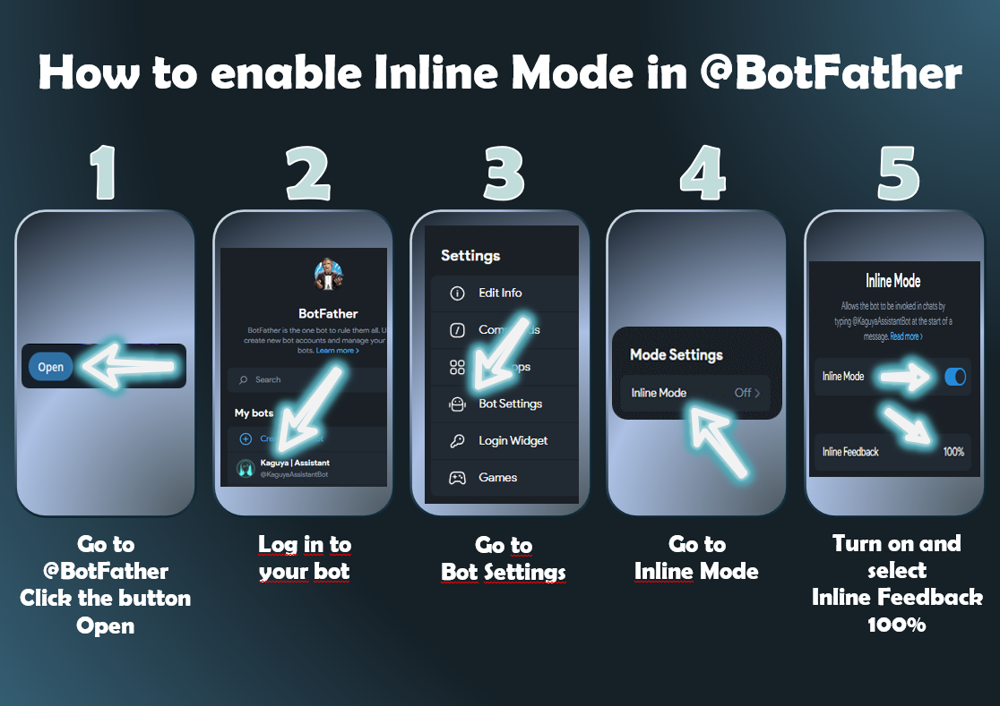

<p align="right">
  <a href="README.ru.md">🇷🇺 Перейти на русскую версию</a>
</p>

<p style="text-align: center;">
  
</p>

<p style="text-align: center;">
  <b>KaguyaUserBot — an asynchronous, lightweight, modular Telegram client (UserBot) featuring parallel assistant-bot integration, dynamic "hot-loading" of custom modules, and multi-language support.</b>
  <br><br>
  <a href="https://github.com/cxvimba/kaguya-modules">📦 Official Modules Directory</a> •
  <a href="#3-installation-and-deployment">📥 Installation</a> •
  <a href="#5-module-development">🛠️ Developer Guide</a>
</p>

---

## 1. Project Description and Architecture

**KaguyaUserBot** is an event-driven framework built on top of the `kurigram` library (a high-performance and actively maintained fork of `pyrogram`). The main goal of the project is to provide developers and users with a flexible, lightweight environment to run userbots and automate daily tasks without the need to deploy heavy external database management systems (DBMS).

### Key Architectural Features:

* **Microkernel Architecture:** The core client `KaguyaClient` acts as a lightweight kernel. It is solely responsible for authentication, reading global settings, session maintenance, and event routing. All application logic is offloaded to decoupled, dynamic modules that can be loaded and unloaded on the fly.
* **Hybrid Operation Mode:** Two clients run concurrently within a single Event Loop: the userbot (via MTProto) and the assistant bot (via Telegram Bot API). They interact through a shared database and complement each other, allowing for interactive inline menus and buttons in any chat.
* **Shared Local Database:** Instead of deploying heavy external database servers, the project utilizes an embedded Key-Value store based on the `diskcache` library (running on top of optimized SQLite with an asynchronous wrapper via `asyncio.to_thread`). The database supports TTL (Time-To-Live) for automatic expiration and category-based data isolation.
* **Internationalization (i18n):** The userbot is equipped with a fast localization system (ISO 639-1 standard). The active system language is cached in the client's RAM (`client.get_lang()`), allowing modules to translate their interface on the fly without any disk-read latency or database overhead.
* **Media Resource Caching:** To conserve network bandwidth and prevent `Flood Wait` issues, the project employs the `edit_media_cached` method. Upon sending an interface media file from disk for the first time, the `file_id` received from Telegram servers is cached. All subsequent calls to this menu utilize the cached `file_id`, ensuring near-instant rendering.

---

## 2. Disclaimer

> **WARNING:** Running userbots violates the official Telegram Terms of Service ([Terms of Service](https://telegram.org/tos/?setln=en)), as it automates account actions via the MTProto API. 
> 
> * The project author **is not responsible** for any potential blocks or restrictions placed on your account by Telegram's anti-spam algorithms.
> * The Kaguya client mimics the official Windows Desktop client to minimize detection risks; however, complete safety cannot be guaranteed.
> * **Module Security:** Installed modules run within the same process as the core client and have full access to your session files (`.session`) and environment variables. Only install modules from trusted sources!

---

## 3. Installation and Deployment

### Getting API Keys
To run an MTProto client, you must obtain API keys from Telegram:
1. Log in to [my.telegram.org](https://my.telegram.org/).
2. Navigate to **API Development Tools** and create a new application.
3. Save your `API_ID` and `API_HASH` values.

---

### Running on Windows

The project features an automated bootstrap script that sets up a Python virtual environment (`venv`) and installs all dependencies in one click.

1. Install [Python 3.11 or higher](https://www.python.org/downloads/) (make sure to check **"Add Python to PATH"** during installation).
2. Download and unpack the KaguyaUserBot repository.
3. Run `[Windows]Kaguya_run.bat`.
4. The script will verify your environment, install dependencies, and automatically generate an empty `.env` configuration file in the project root (a template is also available in `.env.example`).
5. Open `.env` in Notepad and insert your keys:
   ```env
   API_ID=your_api_id
   API_HASH=your_api_hash
   ```
6. Save the file and run `[Windows]Kaguya_run.bat` again. Enter your phone number and the Telegram confirmation code to establish a session.
    * **Note on compilation:** The `tgcrypto` encryption acceleration library requires a C++ compiler to build from source on Windows. Our launcher `[Windows]Kaguya_run.bat` automatically catches compilation errors, skips them, and runs the bot using Python's built-in cryptographic fallbacks seamlessly.

---

### Running on Android

To run the userbot on smartphones, the Termux terminal emulator is used.

1. Install the Termux application (the F-Droid build is highly recommended).
2. Launch Termux and execute the command for automated project initialization:
   ```Bash
   bash [Termux]Kaguya_run.sh
   ```
3. The script will automatically install `python`, `git`, configure the virtual environment, and install dependencies.
4. Copy the environment configuration template:
   ```Bash
   cp .env.example .env
   ```
5. Open `.env` in a built-in terminal editor (e.g., `nano .env`), configure your `API_ID` and `API_HASH`, then run the script again to authenticate.

---

### Running on Ubuntu

**Step 1. Prepare Server**

Connect to your VPS via SSH and install the required system packages:
```Bash
sudo apt update && sudo apt upgrade -y
sudo apt install python3 python3-venv python3-pip git nano -y
```

**Step 2. Clone and Setup Project**

```Bash
git clone https://github.com/cxvimba/KaguyaUserBot.git
cd KaguyaUserBot
```

Create a virtual environment, activate it, and install dependencies:
```Bash
python3 -m venv .venv
source .venv/bin/activate
pip install -r requirements.txt
```

Copy the environment configuration template:
```Bash
cp .env.example .env
nano .env
```
Type your `API_ID` and `API_HASH` in the opened nano text editor, save changes (`Ctrl+O` ➔ `Enter`), and exit via `Ctrl+X`.

**Step 3. Initial Launch and Authorization**

Run the script manually once to complete authorization and generate a session file:
```Bash
python3 main.py
```
Enter your phone number and the Telegram verification code. Once Kaguya indicates that it has successfully started, stop it by pressing `Ctrl + C`.

**Step 4. Configure 24/7 Autostart via Systemd (Recommended)**

To ensure the bot runs persistently in the background and restarts automatically on server reboot, configure a systemd service.

Create the service file:
```Bash
sudo nano /etc/systemd/system/kaguya.service
```

Insert the following template (replace `/root/KaguyaUserBot` with your actual project directory path, if different):
```Ini
[Unit]
Description=Kaguya UserBot Service
After=network.target

[Service]
Type=simple
WorkingDirectory=/root/KaguyaUserBot
ExecStart=/root/KaguyaUserBot/.venv/bin/python main.py
Restart=always
RestartSec=10

[Install]
WantedBy=multi-user.target
```

Save the file (`Ctrl+O` ➔ `Enter` ➔ `Ctrl+X`). Activate and start the service:
```Bash
sudo systemctl daemon-reload
sudo systemctl enable kaguya.service
sudo systemctl start kaguya.service
```

---

## 4. Helper Bot Integration

The assistant bot outputs interactive inline keyboards, flag grids, and settings menus.

1. Go to the official [@BotFather](https://t.me/BotFather) bot in Telegram and create a new bot (`/newbot`).
2. In your bot settings, navigate to `Bot Settings ➔ Inline Mode` and enable it.
3. In the same menu, go to `Inline Feedback` and select `100%` (required for proper Inline callback operation).
4. Send the bind command to your running userbot in any chat:
   ```
   .token <your_BotFather_token>
   ```
5. On-the-fly validation: The userbot will instantly launch the assistant in the background, send a hidden inline query to verify inline mode activity, and bind it to the core.
   * If inline mode is disabled in BotFather, the assistant bot will automatically stop, wipe the token from the database, and display a detailed graphic guide on how to fix the issue.

Upon a successful startup, you will receive a confirmation message in your **Saved Messages («me»)** indicating system readiness, along with a quick tip on changing localization via the `.lang <code_here>` command.

<p style="text-align: center;">
   
</p>

---

## 5. Module Development

The Kaguya framework supports two module formats in the `kaguya/modules/` directory:
1. **Single-file modules** (simple `.py` scripts).
2. **Package modules** (complex modules with assets, configs, and submodules), containing an entry-point `__init__.py` file.

---

### Architecture of a Multi-Language Plugin (Single File)

To support multilingual localization and enable proper IDE integration (autocomplete hints in PyCharm Pro), any module should inherit from `BaseModule`, declare a class-level `LANGUAGES` dictionary, and use strict type hints.

```Python
from pyrogram import Client
from pyrogram.types import Message
from kaguya.types import BaseModule, ModuleInfo, on_command
from typing import TYPE_CHECKING

# Circular import protection and PyCharm Pro autocomplete activation
if TYPE_CHECKING:
    from kaguya.client import KaguyaClient

class AutoReply(BaseModule):
    meta = ModuleInfo(
        name="Auto-Responder",
        description="Saves and automatically outputs replies in chat",
        version="1.1.0",
        author="cxvimba",
        commands={
            "set_reply | задать_ответ": "Save auto-reply (format: .set_reply word | response)"
        }
    )

    # Localization dictionary.
    # The first language in the dict (in this case, "en") automatically becomes
    # the default fallback if the user selects a language unsupported by this plugin.
    LANGUAGES = {
        "en": {
            "usage": "❌ **Kaguya:** Format: `.set_reply trigger | reply text`",
            "separator": "❌ **Kaguya:** Split trigger and reply using `|`",
            "success": "✅ **Kaguya:** Auto-reply for «{trigger}» successfully saved!"
        },
        "ru": {
            "usage": "❌ **Kaguya:** Формат: `.set_reply триггер | текст ответа`",
            "separator": "❌ **Kaguya:** Разделяй триггер и ответ символом `|`",
            "success": "✅ **Kaguya:** Автоответ на слово «{trigger}» успешно сохранен!"
        }
    }

    @on_command(["set_reply", "задать_ответ"])
    async def set_reply_cmd(self, client: "KaguyaClient", message: Message):
        """Parses arguments and saves auto-reply into the local database."""
        if len(message.command) < 2:
            # Synchronously fetch the localized string via BaseModule's get_text helper
            await message.edit_text(self.get_text("usage"))
            return

        raw_text = message.text.split(maxsplit=1)[1]
        if "|" not in raw_text:
            await message.edit_text(self.get_text("separator"))
            return

        trigger, reply_text = map(str.strip, raw_text.split("|", 1))

        # Access diskcache-backed SQLite local DB through categories
        db = self.client.db.get_category("auto_responses")
        await db.set(trigger.lower(), reply_text)
        
        # Display formatted output with automatic translation lookup
        await message.edit_text(self.get_text("success").format(trigger=trigger))
```

---

### Architecture of a Package Module

For Kaguya to recognize a directory as a package module, an `__init__.py` file must be present inside it. All handlers and command logic can be split into separate files (e.g., `commands.py`) and then imported and bound as class attributes in `__init__.py`:

```Python
# kaguya/core_modules/system/modules.py
@on_command(['modules', 'модули'])
async def list_modules(self, client: Client, message: Message):
    ...


# kaguya/core_modules/system/__init__.py
from kaguya.types import BaseModule, ModuleInfo
from .modules import list_modules, install_module
    
class SystemModule(BaseModule):
    meta = ModuleInfo(
        name='System',
        description='Kaguya core system utilities',
        version='1.1.0',
        author='cxvimba',
        commands={
           'modules': 'Module list',
           'install': 'Install custom module'
        }
    )
    
    # Multilingual support at the package-class level
    LANGUAGES = {
        "en": { "no_modules": "⚠️ No loaded modules found." },
        "ru": { "no_modules": "⚠️ Нет загруженных модулей." }
    }
    
    # Bind functions imported from external files as class methods
    list_modules = list_modules
    install_module = install_module
```

---

### Localizing Graphical Assets

If your plugin includes custom images or interactive menu covers, you can load localized images dynamically by running a quick file existence check:

```Python
# Fetch system language directly from KaguyaClient's RAM cache
lang = client.get_lang() 

# Format path to localized file
local_path = f'assets/Kaguya_modules_{lang}.png'

# Fallback to default asset if localized file is missing
if not os.path.exists(local_path):
    local_path = 'assets/Kaguya_modules.png'

# Set unique Telegram cache keys for each localized file to prevent overlapping
cache_key = f'modules_menu_file_id_{lang}'

await client.edit_media_cached(
    message=message,
    cache_key=cache_key,
    local_path=local_path,
    caption=text
)
```

---

### Event Decorators:

* `@on_command(command_name: str | list[str])` — Registers a userbot chat command. Supports alias lists and is case-insensitive. Works via a custom dynamic filter retrieving command prefixes directly from the running client's memory.
* `@on_assistant_command(command_name: str | list[str])` — Registers a text command handler for the assistant bot (e.g., `/start`).
* `@on_assistant_inline()` — Handles incoming inline queries sent to the assistant bot.
* `@on_assistant_callback(pattern: str)` — Handles button click callback queries with pre-filtering by `callback_data` prefix.

---

### Callback Protection

To prevent unauthorized users from hijacking your assistant buttons in public chats, implement sender verification checks:

```Python
# Example from the system translator module
@on_assistant_callback('tr_')
async def translator_callback(self, client: Client, callback_query: CallbackQuery):
    settings = client.db.get_category('settings')
    owner_id = await settings.get('owner_id')

    # Block unauthorized clicks
    if callback_query.from_user.id != owner_id:
        await callback_query.answer(
            text='Kaguya: Hey, this is not your control panel!',
            show_alert=True
        )
        return
```

---

### Static Code Analyzer

When dynamically installing plugins via the `.install` / `.установить` commands (by replying to a `.py`, `.txt`, or `.zip` file), the core client automatically runs static code analysis checks prior to compilation.

The analyzer scans the incoming code for the following blocked call patterns:
`eval(`, `exec(`, `__import__`, `os.system`, `subprocess`, `.session`, `session_path`.

If any match is detected, the installation terminates immediately, and temporary files are securely deleted from the disk to prevent any environmental impact.

---

## 6. Frequently Asked Questions (FAQ)

---

**Q: The `[Windows]Kaguya_run.bat` script throws a "Failed building wheel for tgcrypto" error. Will the bot start?**  
**A:** Yes, it will start and operate normally. This error occurs because pre-compiled wheel packages of `tgcrypto` are not always available for all Windows environments. You can install a C++ compiler to compile it, but the bot will automatically fall back to Python's built-in cryptographic solutions and run stably without it.

---

**Q: How do I add external dependencies for my custom module?**  
**A:** Since the Kaguya core should remain clean and independent, you do not need to add your packages to the root `requirements.txt`. Instead, use the standard Python import exception handling pattern at the top of your custom module:
```Python
try:
    import some_library
except ImportError:
    raise ImportError("This module requires the 'some_library' package. Install it via terminal: pip install some_library")
```
When installing your module via `.install`, the framework will catch the `ImportError` safely and display your installation instructions in the Telegram chat instead of crashing.

---

**Q: My assistant bot does not respond to button clicks or inline queries. What should I do?**  
**A:** The most common cause is that inline mode is disabled in BotFather. [Please follow the inline setup guide in Section 4.](#4-helper-bot-integration)

---

**Q: How do I run Kaguya 24/7 on a remote server?**  
**A:** The most reliable way is using a VPS running Linux (Ubuntu/Debian). [Follow the complete setup and daemonization guide in the Ubuntu section.](#running-on-ubuntu)

---

**Q: Where are the bot settings and cache stored? How do I reset them completely?**  
**A:** All persistent configuration and cached files are stored in `data/storage/` as optimized SQLite Key-Value tables managed by `diskcache`.
* To unbind your helper bot, use the `.token_rm` command.
* To perform a complete factory reset, stop the bot in the terminal and delete the `data/` folder. Kaguya will recreate clean databases automatically upon next boot.