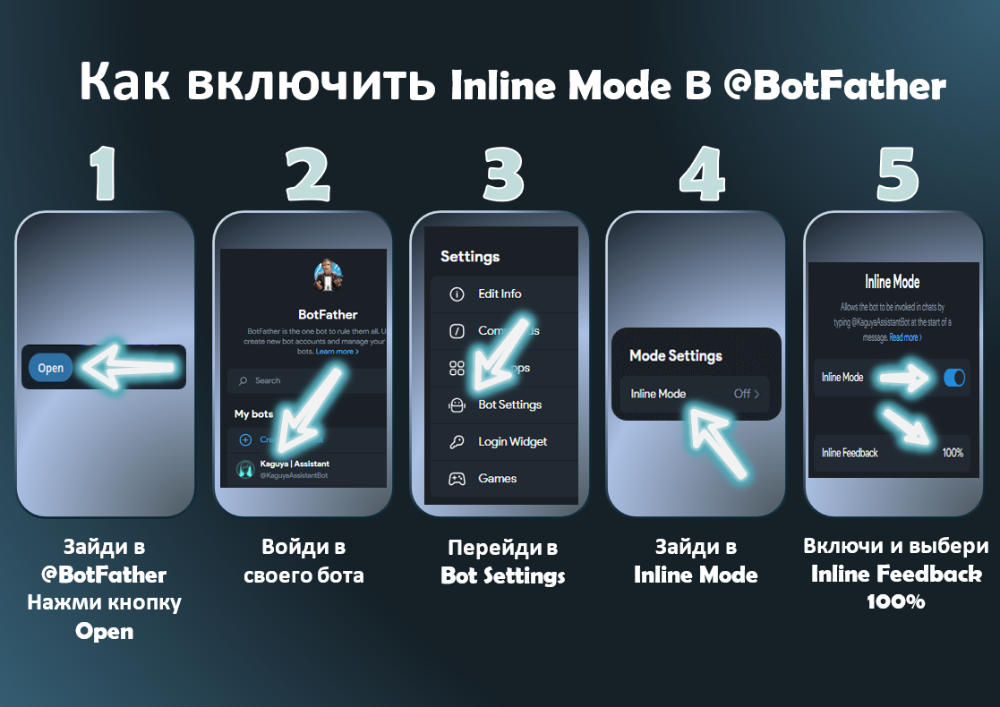

<p align="right">
  <a href="README.md">🇺🇸 Switch to English version</a>
</p>

<p style="text-align: center;">
  
</p>

<p style="text-align: center;">
  <b>KaguyaUserBot — асинхронный, легковесный модульный Telegram-клиент (UserBot) с параллельной интеграцией бота-помощника и динамической загрузкой кастомных модулей.</b>
</p>

---

## 1. Описание проекта и архитектура

**KaguyaUserBot** — это событийно-ориентированный фреймворк, построенный на базе библиотеки `kurigram` (высокопроизводительного и активно поддерживаемого форка `pyrogram`). Основная задача проекта — предоставить разработчикам и пользователям гибкую, легковесную среду для запуска юзерботов без необходимости развертывания тяжелых СУБД для автоматизации повседневных задач.

### Ключевые архитектурные особенности:

* **Архитектура микроядра:** Основной клиент `KaguyaClient` выполняет роль легковесного ядра. Он отвечает за авторизацию, чтение глобальных настроек, поддержание сессии и маршрутизацию событий. Вся прикладная логика вынесена в автономные динамические модули, которые можно загружать и выгружать на лету.
* **Гибридный режим работы:** Внутри одного Event Loop параллельно работают два клиента: юзербот (через протокол MTProto) и бот-ассистент (через Telegram Bot API). Они взаимодействуют через единую базу данных и дополняют друг друга, что позволяет реализовывать интерактивные инлайн-меню и кнопки в любых чатах.
* **Общая локальная БД:** Вместо тяжелых внешних серверов баз данных используется встроенное Key-Value хранилище на базе библиотеки `diskcache` (работающей поверх оптимизированного SQLite с асинхронной оберткой через `asyncio.to_thread`). Система поддерживает автоматическое удаление устаревших записей и изолированное разделение данных по категориям.
* **Кэширование медиа-ресурсов:** Для экономии сетевого трафика и защиты от `Flood Wait` используется метод `edit_media_cached`. При первой отправке интерфейсного медиафайла с диска полученный от серверов Telegram идентификатор `file_id` сохраняется в кэш. Все последующие вызовы этого меню используют уже закэшированный `file_id`, обеспечивая мгновенный рендеринг.
* **Интернационализация:** Юзербот оснащен быстрой системой локализации (стандарт ISO 639-1). Текущий язык системы кэшируется в оперативной памяти клиента (`client.get_lang()`), что позволяет переводить интерфейс модулей без задержек на дисковые запросы к СУБД.

---

## 2. Дисклеймер

> **ВНИМАНИЕ:** Запуск юзерботов нарушает официальные Правила предоставления услуг Telegram ([Terms of Service](https://telegram.org/tos/?setln=ru)), так как автоматизирует действия в аккаунте через MTProto API. 
> 
> * Автор проекта **не несет ответственности** за возможные блокировки или ограничения вашего аккаунта со стороны антиспам-алгоритмов Telegram.
> * Клиент Kaguya мимикрирует под официальный Windows Desktop клиент, чтобы минимизировать риски обнаружения, однако полная безопасность не гарантируется.
> * **Безопасность модулей:** Устанавливаемые модули выполняются в том же процессе, что и ядро, и имеют полный доступ к вашим файлам сессий (`.session`) и переменным окружения. Устанавливайте модули только из доверенных источников!

---

## 3. Установка и развертывание

### Подготовка ключей
Для работы MTProto-клиента необходимо получить ключи API в Telegram:
1. Авторизуйтесь на сайте [my.telegram.org](https://my.telegram.org/).
2. Перейдите в раздел **API Development Tools** и создайте новое приложение.
3. Сохраните полученные значения параметров `API_ID` и `API_HASH`.

---

### Примечание

При успешном запуске юзербота вы получите уведомление в свое **Избранное («Saved Messages»)** с информацией о готовности к работе и быстрой подсказкой о смене локализации с помощью команды `.lang <код>`.

---

### Запуск на Windows

Проект содержит готовый сценарий автоматического развертывания виртуального окружения `venv` и установки зависимостей в один клик.

1. Установите [Python 3.11 или выше](https://www.python.org/downloads/) (при установке обязательно отметьте флаг **«Add Python to PATH»**).
2. Скачайте архив репозитория KaguyaUserBot и распакуйте его.
3. Запустите файл `[Windows]Kaguya_run.bat`.
4. Скрипт проверит окружение, установит зависимости и автоматически создаст пустой файл конфигурации `.env` в корне проекта.
5. Откройте файл `.env` в Блокноте и впишите туда свои ключи:
   ```env
   API_ID=ваш_api_id
   API_HASH=ваш_api_hash
   ```
6. Сохраните файл и запустите [Windows]Kaguya_run.bat заново. Введите ваш номер телефона и код подтверждения из Telegram для создания сессии. 
    * **Примечание по компиляции:** Библиотека ускорения шифрования tgcrypto требует компилятор C++ для сборки из исходников. Наш загрузчик `[Windows]Kaguya_run.bat` автоматически распознает ошибки компиляции, пропустит их и запустит бота на встроенных средствах шифрования Python без необходимости ставить компиляторы.

---

### Запуск на Android

Для работы юзербота на смартфонах используется эмулятор терминала Termux.

1. Установите приложение Termux (рекомендуется сборка из F-Droid).
2. Запустите Termux и выполните команду для автоматической инициализации проекта:
   ```Bash
   bash [Termux]Kaguya_run.sh
   ```
3. Скрипт самостоятельно установит пакеты `python`, `git`, развернет окружение и запустит установку библиотек построчно.
4. Скопируйте шаблон `.env.example` в рабочий файл настроек: 
   ```Bash
   cp .env.example .env
   ```
5. Настройте ключи `API_ID` и `API_HASH` внутри `.env` и запустите скрипт заново для авторизации.

---

### Запуск на Ubuntu

**Шаг 1. Подготовка сервера**

Подключись к своему VPS по SSH и установи необходимые системные пакеты:
```Bash
sudo apt update && sudo apt upgrade -y
sudo apt install python3 python3-venv python3-pip git nano -y
```

**Шаг 2. Клонирование и настройка проекта**

```Bash
git clone https://github.com/cxvimba/KaguyaUserBot.git
cd KaguyaUserBot
```

Создай виртуальное окружение, активируй его и установи библиотеки:

```Bash
python3 -m venv .venv
source .venv/bin/activate
pip install -r requirements.txt
```

Скопируй шаблон настроек в рабочий файл конфигурации:

```Bash
cp .env.example .env
nano .env
```

Впиши свои `API_ID` и `API_HASH` в открывшемся текстовом редакторе nano, сохрани изменения нажатием `Ctrl+O` ➔ `Enter`, а затем выйди через `Ctrl+X`.

**Шаг 3. Первый запуск и авторизация**

Запусти скрипт вручную один раз, чтобы пройти авторизацию в Telegram и сгенерировать файл сессии:

```Bash
python3 main.py
```

Введи свой номер телефона и код подтверждения из Telegram. Как только Kaguya напишет, что успешно запущена — останови её комбинацией клавиш `Ctrl + C`.

**Шаг 4. Настройка автозапуска 24/7 через Systemd (Рекомендуется)**

Чтобы бот работал в фоновом режиме, не выключался при закрытии консоли и сам поднимался при перезагрузке сервера, настроим системную службу.

Создай файл службы:

```Bash
sudo nano /etc/systemd/system/kaguya.service
```

Вставь туда следующий шаблон (замени `/root/KaguyaUserBot` на твой реальный путь к проекту, если он отличается):

```Ini
[Unit]
Description=Kaguya UserBot Service
After=network.target

[Service]
Type=simple
WorkingDirectory=/root/KaguyaUserBot
ExecStart=/root/KaguyaUserBot/.venv/bin/python main.py
Restart=always
RestartSec=10

[Install]
WantedBy=multi-user.target
```

Сохрани файл (`Ctrl+O` ➔ `Enter` ➔ `Ctrl+X`). Теперь активируй и запусти службу:

```Bash
sudo systemctl daemon-reload
sudo systemctl enable kaguya.service
sudo systemctl start kaguya.service
```

---

## 4. Интеграция бота-ассистента

Бот-ассистент обеспечивает вывод интерактивных клавиатур флагов и меню настроек.

1. Перейдите в чат с официальным ботом [@BotFather](https://t.me/BotFather) и создайте нового бота (`/newbot`).
2. В меню настроек вашего нового бота перейдите в `Bot Settings ➔ Inline Mode` и включите его.
3. Там же перейдите в `Inline Feedback` и выберите значение `100%` (обязательно для корректной работы Inline).
4. Напишите вашему юзерботу команду привязки:
   ```
   .токен <ваш_токен_из_BotFather>
   ```
5. Валидация: Юзербот мгновенно запустит ассистента в фоне, отправит скрытый инлайн-запрос для проверки активности инлайн-режима и привяжет его к ядру.
   * Если инлайн-режим не был включен в BotFather, бот-помощник автоматически остановится, сотрет токен из базы во избежание сбоев и выведет в чат подробную пошаговую инфографику по исправлению проблемы.

<p style="text-align: center;">
   
</p>

---

## 5. Разработка модулей (плагинов)

Фреймворк Kaguya поддерживает два формата модулей в папке kaguya/modules/:
1. **Одиночные .py файлы** (простые утилиты). 
2. **Папки-пакеты** (сложные модули с собственными ассетами, конфигами и подмодулями), содержащие на входе файл инициализации `__init__.py`.

---

### Архитектура мультиязычного плагина (одиночный файл)

Для поддержки мультиязычности и правильной интеграции любой модуль должен содержать класс, унаследованный от `BaseModule` и объявлять словарь `LANGUAGES` на уровне класса.

```Python
class AutoReply(BaseModule):
    meta = ModuleInfo(
        name='Автоответчик',
        description='Сохраняет и выводит автоматические ответы в чатах',
        version='1.0.0',
        author='Anonymous',
        commands={
            'set_reply | задать_ответ': 'Сохранить автоответ (формат: .set_reply слово | ответ)'
        }
    )

    # Словарь локализации. 
    # Язык, указанный первым в словаре, автоматически станет вариантом по умолчанию, 
    # если пользователь выберет язык, которого нет в плагине.
    LANGUAGES = {
        'en': {
            'usage': '❌ **Kaguya:** Format: `.set_reply trigger | reply text`',
            'separator': '❌ **Kaguya:** Split trigger and reply using `|`',
            'success': '✅ **Kaguya:** Auto-reply for «{trigger}» successfully saved!'
        },
        'ru': {
            'usage': '❌ **Kaguya:** Формат: `.set_reply триггер | текст ответа`',
            'separator': '❌ **Kaguya:** Разделяй триггер и ответ символом `|`',
            'success': '✅ **Kaguya:** Автоответ на слово «{trigger}» успешно сохранен!'
        }
    }

    @on_command(['set_reply', 'задать_ответ'])
    async def set_reply_cmd(self, client: Client, message: Message):
        """Парсит аргументы и сохраняет автоответ в базу данных."""
        if len(message.command) < 2:
            await message.edit_text(self.get_text('usage'))
            return

        raw_text = message.text.split(maxsplit=1)[1]
        if '|' not in raw_text:
            await message.edit_text(self.get_text('separator'))
            return

        trigger, reply_text = map(str.strip, raw_text.split("|", 1))

        db = self.client.db.get_category('auto_responses')
        await db.set(trigger.lower(), reply_text)
        
        await message.edit_text(
           self.get_text('success').format(trigger=trigger)
        )
```

---

### Архитектура модуля-пакета

Чтобы Kaguya распознала папку как модуль-пакет, в ней должен присутствовать `__init__.py`. Все обработчики и команды могут быть вынесены в отдельные файлы (например, commands.py), а в `__init__.py` они просто импортируются и привязываются как атрибуты класса `SystemModule`:

```Python
# kaguya/core_modules/system/modules.py
@on_command(['modules', 'модули'])
async def list_modules(self, client: Client, message: Message):
    """Выводит список всех активных моделей."""
    ...
    await client.edit_media_cached(
        message=message,
        cache_key='modules_menu_file_id',
        local_path='assets/Kaguya_modules.png',
        caption=text
    )


# kaguya/core_modules/system/__init__.py
from kaguya.types import BaseModule, ModuleInfo
from .modules import list_modules, install_module
    
class SystemModule(BaseModule):
    meta = ModuleInfo(
        name='Система',
        description='Системные утилиты Kaguya',
        version='1.0.0',
        author='Anonymous',
        commands={
           'modules': 'Список модулей',
           'install': 'Установить модуль'
        }
    )
    
    # Поддержка языков на уровне пакета
    LANGUAGES = {
        'en': { ... },
        'ru': { ... }
    }
    
    # Привязка функций из внешних файлов как методы класса
    list_modules = list_modules
    install_module = install_module
```

---

### Локализация графических ассетов

Если плагин использует изображения-подсказки или обложки меню, их можно динамически подгружать в зависимости от языка пользователя, используя проверку файлов на диске:

```Python
lang = client.get_lang() 

# Путь к локализованной картинке
local_path = f'assets/Kaguya_modules_{lang}.png'

# Откат к базовому файлу если язык не поддерживается
if not os.path.exists(local_path):
    local_path = 'assets/Kaguya_modules.png'

# Присвоение каждой языковой версии уникального кэша
cache_key = f'modules_menu_file_id_{lang}'

await client.edit_media_cached(
    message=message,
    cache_key=cache_key,
    local_path=local_path,
    caption=text
)
```

---

### Событийные декораторы:

* `@on_command(command_name: str | list[str])` — Регистрирует команду юзербота. Поддерживает списки алиасов и регистронезависимость. Работает на базе кастомного динамического фильтра (префиксы берутся из оперативной памяти клиента).
* `@on_assistant_command(command_name: str | list[str])` — Регистрирует текстовый обработчик команд внутри бота-ассистента (например, `/start`).
* `@on_assistant_inline()` — Обрабатывает входящие инлайн-запросы, отправленные боту-ассистенту.
* `@on_assistant_callback(pattern: str)` — Обрабатывает клики на кнопки ассистента с фильтрацией по префиксу `callback_data`.

---

### Защита кнопок

Любые клики по кнопкам ассистента должны проходить верификацию на отправителя во избежание несанкционированного доступа посторонних участников чата:

```Python
# На примере системного переводчика
@on_assistant_callback('tr_')
async def translator_callback(self, client: Client, callback_query: CallbackQuery):
    settings = client.db.get_category('settings')
    owner_id = await settings.get('owner_id')

    # Блокировка несанкционированных кликов
    if callback_query.from_user.id != owner_id:
        await callback_query.answer(
            text='Kaguya: Эй, это не твоя панель управления!',
            show_alert=True
        )
        return
```

---

### Статический анализатор кода

При динамической установке модулей через команду `.install` / `.установить` (ответом на файл `.py`, `.txt` или `.zip`), ядро автоматически проверяет код на наличие заблокированных системных вызовов перед компиляцией.

Бот проверяет код на наличие следующих триггеров:
`eval(`, `exec(`, `__import__`, `os.system`, `subprocess`, `.session`, `session_path`.

Если хотя бы один паттерн найден — установка прерывается, а временные файлы безопасно стираются с диска для предотвращения возможного заражения системы.

---

## 6. Часто задаваемые вопросы (FAQ)

---

#### В: Батник `[Windows]Kaguya_run.bat` выдает ошибку "Failed building wheel for tgcrypto". Бот запустится? 
**О:** Да, запустится и будет работать абсолютно стабильно. Ошибка возникает потому что разработчики tgcrypto еще не скомпилировали готовые бинарные пакеты под Windows. Можно установить компилятор C++ и перезапустить скрипт.

---

#### В: Как мне добавить стороннюю библиотеку для моего собственного модуля?
**О:** Поскольку ядро Кагуи должно оставаться чистым и независимым, не нужно добавлять свои библиотеки в корневой `requirements.txt`. Вместо этого используй Python-паттерн обработки исключений импорта в начале своего модуля:
```Python
try:
    import some_library
except ImportError:
    raise ImportError("Для работы модуля требуется библиотека 'some_library'. Установи её командой: pip install some_library")
```
Наша песочница при попытке установить твой модуль через `.install` / `.установить` безопасно перехватит этот `ImportError` и выведет твою инструкцию пользователю прямо в чат Telegram.

---

#### В: Мой бот-ассистент не реагирует на клики кнопок или инлайн-запросы. Что делать?
**О:** Самая частая причина — выключенный инлайн-режим в настройках самого бота в Telegram. [**Инструкция настройки Инлайн-режима описана в 4 разделе.**](#4-интеграция-бота-ассистента)

---

#### В: Как запустить Кагую на удаленном сервере 24/7?
**О:** Самый надежный способ запустить бота круглосуточно — использовать VPS под управлением Linux (Ubuntu/Debian). [Подробный алгоритм запуска описан в тут.](#запуск-на-ubuntu)

---

#### В: Где хранятся настройки и кэш бота? Как их полностью сбросить?
**О:** Все данные хранятся в папке `data/storage/` в виде высокоскоростных локальных баз SQLite `diskcache`.

* Если вам нужно отвязать бота-помощника, используйте команду `.токен_удалить`.
* Если вы хотите полностью сбросить все настройки бота до заводских, просто остановите бота в консоли и удалите папку `data/storage/` с диска. При следующем старте Кагуя создаст чистую базу автоматически. 
* Если необходимо сбросить сессии, удалите файлы `.session` в папке `data/`.
